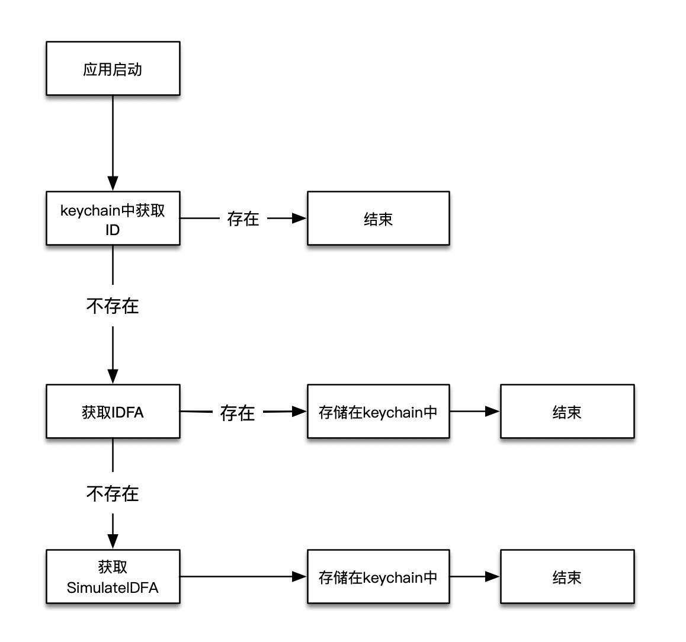

iOS 10以后Apple对IDFA的获取逻辑进行了更新

- iOS10以前，君子协议，不管用户是否同意使用IDFA，都可以获取到IDFA
- iOS10以后，一旦开启了`设置->隐私->广告->限制广告跟踪`之后 获取到的idfa将会是`00000000-0000-0000-0000-000000000000`

隐私一直是Apple的重中之重，从UDID，到MAC地址，再到IDFA，Apple在一步一步保护用户的隐私，但是也给开发者带来了不小的麻烦。在实际研发中，很多功能都要依赖于用户画像，而用户画像要依赖于设备唯一标识。

在用户限制广告跟踪之后，依旧要寻找IDFA的替代品

## 模拟设备唯一标识

在现行的环境中，要模拟设备唯一标识，需要考虑以下几个方面

- 较长的时效性
- 较长的存储性
- 较低的冲突率
- 较低的漂移率

### 一、较长的时效性

[SimulateIDFA](https://github.com/youmi/SimulateIDFA/wiki/%E4%B8%AD%E6%96%87%E8%AF%B4%E6%98%8E%E6%96%87%E6%A1%A3)是一个开源的根据设备信息生成UUID的库

> 生成原理
> 
> 生成的MD5值分两部分。
> 
> 以 626363D0-90D4-06BF-C281-384E4E69D3E2 为例：
> 
> 前16位626363D0-90D4-06BF是由比较稳定的参数组合获得,这前16位只有在系统升级的情况下才会变。
> 
> 后16位C281-384E4E69D3E2 由 一些比较容易被改变的参数组合生成，比较常见的值变化情况是系统重新启动。
> 
> 参与前16位计算的参数有：
> 
> 系统版本（9.3.2）、硬件信息（N53AP,iPhone6,2,中国移动46002,1048576000）、coreServices文件创建更新时间(2015-08-07 23:53:00 +0000,2016-06-07 23:53:09 +0000),系统容量(12266725376)
> 
> 这里有一些信息是升级的时候会变的，系统版本、coreServices文件创建更新时间、系统容量

> 参与后16位计算的参数有：
> 
> 系统开机时间(1473301191去掉后面的4位数 147330)、国家代码(CN)、本地语言(zh-Hans-CN)、设备名称(XXXX)
这里的参数都是比较容易变化的，系统重启离上次重启有10000秒的话会变，其他参数在设置里面可以修改


### 二、较长的存储性

`KeyChain`存储在iOS系统中,并且恢复iPhone会使keychain的内容也恢复。但是删除App是不会影响keychain.
不同App之间Keychain是不能相互访问的，但是可以通过配置keychain-sharing来解决。

### 三、较低的冲突率

[SimulateIDFA](https://github.com/youmi/SimulateIDFA/wiki/%E4%B8%AD%E6%96%87%E8%AF%B4%E6%98%8E%E6%96%87%E6%A1%A3)

> 
>生成的ID重复的概率对比
>假设一个情况。一天内某个国家有10000000（1千万）台相同型号的设备升级到同一个系统。
>
>一天内这个算法可能的值计算， 24x3600（文件创建时间，单位秒）x 10（文件最后修改时间假设误差在10秒）x 10000000（系统容>量误差范围）x 9000000(设备名称范围，这里假设的是每10台就有2个重复,名称范围就是 10000000x0.9)= 77760000000000000000。
>
>设备a的值为 K，那么设备b的值同为K的可能性为： 1/77760000000000000000. 总共有 10000000台设备。因此，这10000000设备中有与a设备的值同为K的可能性为 1/77760000000000000000 x 10000000 = 1/7776000000000。
> 
> iOS10.2 发布后 System/Library/CoreServices 文件夹的创建时间不能获取了。 这样最后算出来的与a可能有值相同的概率是 1/7776000000000 x 24 x 3600 = 1/90000000; ）


### 四、较低的漂移率

较低的漂移率意味着在同一设备中不同App能获取到相同的值

## 最后的解决方案

`SimulateIDFA` + `IDFA` + `KeyChain`

- `SimulateIDFA` 能提供`较长的时效性`和`较低的冲突率`
- `KeyChain` 能提供较长的存储性
- `SimulateIDFA + KeyChain` 能有效的降低漂移率
- 在第一次能获取到`IDFA`的情况下，`IDFA + KeyChain`可以有效防止用户限制广告跟踪之后IDFA的变化

流程如下



核心代码如下

```
+ (NSString *)uuidForDevice {
    NSString *deviceUUID = [XYKeyChain getDataWithServiceDomain:STR_XYUUIDForKeyChainAndDeviceOrIdfa];
    if (deviceUUID && ![deviceUUID isEqualToString:@""] && ![deviceUUID isEqualToString:XY_ZeroIdfa]) {
        return deviceUUID;
    }
    
    NSString *idfa = [self uuidForIDFA];
    if (idfa && ![idfa isEqualToString:@""] && ![idfa isEqualToString:XY_ZeroIdfa]) {
        [XYKeyChain setData:idfa serviceDomain:STR_XYUUIDForKeyChainAndDeviceOrIdfa];
        return idfa;
    }
    
    NSString *deviceInfoUUID = [self uuidForDeviceInfo];
    if (deviceInfoUUID && ![deviceInfoUUID isEqualToString:@""]) {
        [XYKeyChain setData:deviceInfoUUID serviceDomain:STR_XYUUIDForKeyChainAndDeviceOrIdfa];
        return deviceInfoUUID;
    }
    
    NSString *uuid = [self uuid];
    if (uuid && ![uuid isEqualToString:@""]) {
        [XYKeyChain setData:uuid serviceDomain:STR_XYUUIDForKeyChainAndDeviceOrIdfa];
        return uuid;
    }
    
    return @"";
}
```

根据以上组合封装之后即为[YXUUID](https://github.com/guojunliu/XYUUID)


## XYUUID介绍


### XYUUID的优点

- API简单
- 使用了最新的iOS 14 API来获取IDFA
- 具有不同持久性级别的通用唯一标识符

### uuidForDevice的有点

- 较长的时效性
- 较长的存储性
- 较低的冲突率
- 较低的漂移率

### API

获取不同持久化级别的UUID

```
/// 随机UUID，此值每次都会刷新
+ (NSString *)uuid;

/// 安装UUID，每次重新安装，此值会刷新
+ (NSString *)uuidForInstall;

/// 开启应用UUID，每次开启应用，此值会刷新
+ (NSString *)uuidForAppOpen;

/// IDFA，开启关闭授权，此值会刷新
+ (NSString *)uuidForIDFA;

/// IDFV
+ (NSString *)uuidForIDFV;

/// 设备信息UUID，根据设备信息生成，能维持一段时间内不变
+ (NSString *)uuidForDeviceInfo;

/// 钥匙串UUID，卸载应用保持不变
+ (NSString *)uuidForKeychain;

/// 设备UUID，设备唯一标识符
+ (NSString *)uuidForDevice;

```

### 持久化级别


| UUID              	 | App relaunch | Reset Advertising Identifier | App reinstall | System reboot | System upgrade | System reset |
|-----------------------|:----------:|:------------:|:----------------------------:|:-------------:|:-------------:|:--------------:|
| `uuid `                |❌|❌|❌|❌|❌|❌|
| `uuidForInstall `      |✅|✅|❌|✅|✅|❌|
| `uuidForAppOpen `      |❌|✅|❌|❌|❌|❌|
| `uuidForIDFA `    	  |✅|❌|✅|✅|✅|❌|
| `uuidForIDFV `       	  |✅|✅|❌|✅|✅|❌|
| `uuidForDeviceInfo `   |✅|✅|✅|❌|❌|❌|
| `uuidForKeychain `     |✅|✅|✅|✅|✅|❌|
| `uuidForDevice `       |✅|✅|✅|✅|✅|❌|