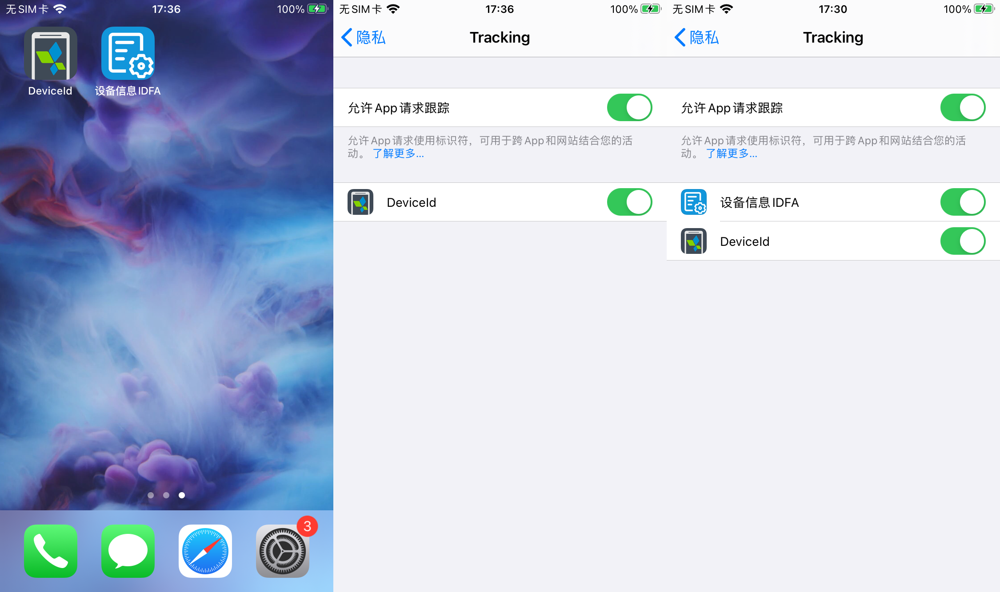
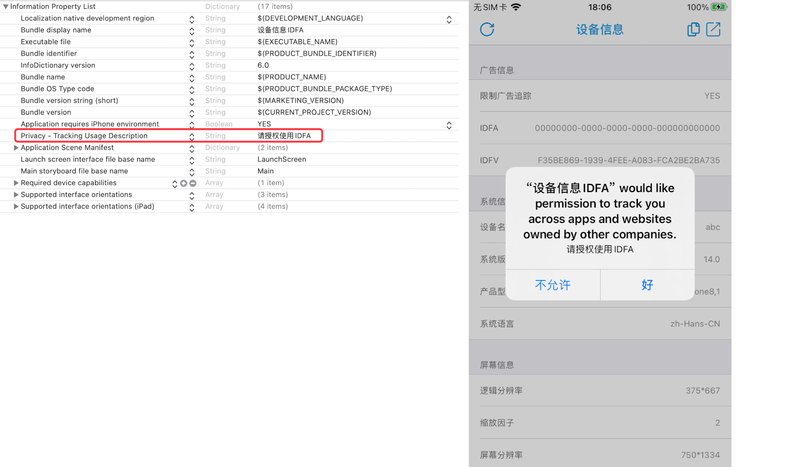

---

layout: post

title: Xcode11提前适配iOS14 IDFA，并打包上线

tags: [SDK, Framework]

Author: Steve.liu

---


背景：

> 为了防止用户在升级到iOS14的时候出现不兼容的情况，也为了提升用户升级系统的平滑感。
> 
> 同时为了统计，广告，归因的一系列功能的在系统升级时不出现空窗期。
> 
> 开发者不能等到iOS发布，以及Xcode12发布之后再去针对App进行优化或者强制要求更新。
> 
> 针对Xcode12 Beta版不能打包上架，以及Xcode11无法使用AppTrackingTransparency系统库的问题，帮助开发者提前适配iOS 14 IDFA，是本文要解决的问题。

### 一、变化

iOS 14 Apple对隐私增加了更强的保护，首当其冲受影响的就是IDFA。

在LAT（Limit Ad Tracking）的机制下又增加ATT（AppTrackingTransparency）机制。

### 二、ATT机制特点

#### 1、前置于LAT机制，当没有ATT的时候，LAT不生效

在iOS 14的系统上如果不使用ATT向用户请求IDFA的使用权限的话，在设置里也不会有，即不主动请求权限，用户也没办法主动开启

#### 2、可以细化到针对不同App启用不同的设置

之前LAT是针对系统的，ATT可以在总开关之外，单独对App进行设置。以前一个App种树，大家乘凉的场景要消失了，现在需要每个App都要向用户请求IDFA权限

<br>


<br>
#### 3、需要和定位相机等权限一样，在info.plits中声明权限，并说明使用目的



### 三、使用ATT

#### 1、获取当前App，用户授权状态

> `+ requestTrackingAuthorizationWithCompletionHandler:`
The request for user authorization to access app-related data.

```
ATTrackingManagerAuthorizationStatus states = [ATTrackingManager trackingAuthorizationStatus];
```

<br>
#### 2、判断用户的授权状态

> `trackingAuthorizationStatus` The authorization status that is current for the calling application.

```
typedef NS_ENUM(NSUInteger, ATTrackingManagerAuthorizationStatus) {
    ATTrackingManagerAuthorizationStatusNotDetermined = 0,
    ATTrackingManagerAuthorizationStatusRestricted,
    ATTrackingManagerAuthorizationStatusDenied,
    ATTrackingManagerAuthorizationStatusAuthorized
} NS_SWIFT_NAME(ATTrackingManager.AuthorizationStatus) API_AVAILABLE(ios(14), macosx(10.16), tvos(14));
```

其中

- `ATTrackingManagerAuthorizationStatusNotDetermined` 未向用户请求授权
- `ATTrackingManagerAuthorizationStatusRestricted` 用户在系统级别开启了限制广告追踪
- `ATTrackingManagerAuthorizationStatusDenied` 用户拒绝向App授权
- `ATTrackingManagerAuthorizationStatusAuthorized` 用户同意向App授权

<br>
#### 3、向用户请求授权

- 当`states`为`ATTrackingManagerAuthorizationStatusAuthorized` 可以使用IDFA

- 当`states`为`ATTrackingManagerAuthorizationStatusRestricted`和`ATTrackingManagerAuthorizationStatusDenied`时需要向用户弹窗请求用户主动去设置里关闭`限制广告追踪`

	

<br>

- 当`states`为`ATTrackingManagerAuthorizationStatusNotDetermined` 向用户发起请求授权

	


<br>
#### 4、全部流程代码

```
// iOS 14请求idfa权限
if (@available(iOS 14.0, *)) {
    ATTrackingManagerAuthorizationStatus states = [ATTrackingManager trackingAuthorizationStatus];
    if (states == ATTrackingManagerAuthorizationStatusNotDetermined) {
        // 未提示用户
        
        [ATTrackingManager requestTrackingAuthorizationWithCompletionHandler:^(ATTrackingManagerAuthorizationStatus status) {
            dispatch_async(dispatch_get_main_queue(), ^{
                // 获取到权限后，依然使用老方法获取idfa
                if (status == ATTrackingManagerAuthorizationStatusAuthorized) {
                    
                }
                else {
                    UIAlertController *alert = [UIAlertController alertControllerWithTitle:@"" message:XYLocalizedString(@"请在设置-隐私-Tracking中允许App请求跟踪") preferredStyle:UIAlertControllerStyleAlert];
                    UIAlertAction *action2 = [UIAlertAction actionWithTitle:XYLocalizedString(@"确认") style:UIAlertActionStyleDefault handler:^(UIAlertAction * _Nonnull action) {}];
                    [alert addAction:action2];
                    [self presentViewController:alert animated:YES completion:nil];
                }
            });
        }];
    }
    else if (states == ATTrackingManagerAuthorizationStatusRestricted) {
        // 限制使用
        UIAlertController *alert = [UIAlertController alertControllerWithTitle:@"" message:XYLocalizedString(@"请在设置-隐私-Tracking中允许App请求跟踪") preferredStyle:UIAlertControllerStyleAlert];
        UIAlertAction *action2 = [UIAlertAction actionWithTitle:XYLocalizedString(@"确认") style:UIAlertActionStyleDefault handler:^(UIAlertAction * _Nonnull action) {}];
        [alert addAction:action2];
        [self presentViewController:alert animated:YES completion:nil];
    }
    else if (states == ATTrackingManagerAuthorizationStatusDenied) {
        // 拒绝
        UIAlertController *alert = [UIAlertController alertControllerWithTitle:@"" message:XYLocalizedString(@"请在设置-隐私-Tracking中允许App请求跟踪") preferredStyle:UIAlertControllerStyleAlert];
        UIAlertAction *action2 = [UIAlertAction actionWithTitle:XYLocalizedString(@"确认") style:UIAlertActionStyleDefault handler:^(UIAlertAction * _Nonnull action) {}];
        [alert addAction:action2];
        [self presentViewController:alert animated:YES completion:nil];
    }
    else if (states == ATTrackingManagerAuthorizationStatusAuthorized) {
        // 可以使用IDFA
    }
}
// iOS 14以下请求idfa权限
else {
    BOOL b = [XYSystemUtil canUseIDFA];
    if (!b) {
        UIAlertController *alert = [UIAlertController alertControllerWithTitle:@"" message:XYLocalizedString(@"请在设置-隐私-广告中允许App请求跟踪") preferredStyle:UIAlertControllerStyleAlert];
        UIAlertAction *action2 = [UIAlertAction actionWithTitle:XYLocalizedString(@"确认") style:UIAlertActionStyleDefault handler:^(UIAlertAction * _Nonnull action) {}];
        [alert addAction:action2];
        [self presentViewController:alert animated:YES completion:nil];
    }
    else {
    	// 可以使用IDFA
    }
}
```

<br>
### 四、测试以及上架（重点来了）

矛盾点

- Xcode11没有iOS14系统库，Xcode12 Beta版无法上架

- 针对iOS14和以下系统单独做适配


针对上架，笔者测试了三种情况

- 使用Xcode12 Beta编译打包直接上传，会直接无法上传，提示

	> ERROR ITMS-90534: "Invalid Toolchain. Your app was built with an unsupported SDK or version of Xcode. If you plan to submit this build to the App Store, make sure you are using the versions listed in https://help.apple.com/xcode/mac/current/#/devf16aefe3b or later."
	
- 使用Xcode12 Beta打包，并修改ipa中info.plist里的Xcode版本号，可以正常上传到Connect，但是提审之后会收到邮件

	>The status of your app has changed to Invalid Binary.
	
- 使用Xcode11 Link iOS14系统库，然后打包上传，在机审之后会提示

	> 此构建版本无效。ITMS-90562: Invalid Bundle - One or more dynamic libraries that are referenced by your app are not present in the dylib search path.

<br>
#### 最后解决方案是

- IDE层面，Xcode11 Link Xcode12 Beta版中的iOS14系统库
- 编译打包层面，代码中不强制Link `AppTrackingTransparency.framework`系统库
- 代码编写层面，使用动态Link系统库，以及runtime调用对应的方法

<br>
#### 第一步 

为了能使用Xcode11来测试和调试ATT，我们需要将Xcode12 Beta版中的`AppTrackingTransparency.framework`copy到Xcode11同目录下

Xcode12 Beta版中的`AppTrackingTransparency.framework`的路径如下

- 真机

	`/Applications/Xcode-beta.app/Contents/Developer/Platforms/iPhoneOS.platform/Developer/SDKs/iPhoneOS.sdk/System/Library/Frameworks/AppTrackingTransparency.framework`

- 模拟器

	`/Applications/Xcode-beta.app/Contents/Developer/Platforms/iPhoneSimulator.platform/Developer/SDKs/iPhoneSimulator.sdk/System/Library/Frameworks/AppTrackingTransparency.framework`

完成此步之后，即可在测试和调试的时候使用Xcode11使用ATT

<br>
#### 第二步

因在Xcode11上使用iOS13 SDK 来Deployment Target，会导致在低版本手机上无法Link高版本系统库，从而Crash，报错

> dyld: Library not loaded: /System/Library/Frameworks/AppTrackingTransparency.framework/AppTrackingTransparency
> 
> Reason: image not found

所以需要`动态Link系统库，以及runtime调用对应的方法`

先创建对应的Runtime反射类`XYATTrackingManager`

头文件`XYATTrackingManager.h`完全copy自`ATTrackingManager.h`,并将类名由`ATTrackingManager`改为`XYATTrackingManager`，代码如下：

```
#import <Foundation/Foundation.h>
#import <os/availability.h>

typedef NS_ENUM(NSUInteger, ATTrackingManagerAuthorizationStatus) {
    ATTrackingManagerAuthorizationStatusNotDetermined = 0,
    ATTrackingManagerAuthorizationStatusRestricted,
    ATTrackingManagerAuthorizationStatusDenied,
    ATTrackingManagerAuthorizationStatusAuthorized
} NS_SWIFT_NAME(ATTrackingManager.AuthorizationStatus) API_AVAILABLE(ios(14), macosx(10.16), tvos(14));

API_AVAILABLE(ios(14), macosx(10.16), tvos(14))
@interface XYATTrackingManager : NSObject

/*!
 * @property trackingAuthorizationStatus
 *
 * @abstract
 * Returns information about your application’s tracking authorization status.
 * Users are able to grant or deny developers tracking privileges on a per-app basis.
 * Application developers must call `requestTrackingAuthorizationWithCompletionHandler:` for the ability to track users.
 *
 * @result
 * The current authorization status. If the user has not yet been prompted to approve access, the return value will either be
 * ATTrackingManagerAuthorizationStatusNotDetermined, or ATTrackingManagerAuthorizationStatusRestricted if this value is managed.
 * Once the user has been prompted, the return value will be either ATTrackingManagerAuthorizationStatusDenied or ATTrackingManagerAuthorizationStatusAuthorized.
 */
@property (class, nonatomic, readonly, assign) ATTrackingManagerAuthorizationStatus trackingAuthorizationStatus;

/*!
 * @method requestTrackingAuthorizationWithCompletionHandler:completion:
 *
 * @abstract
 * Request user tracking authorization with a completion handler returning the user's authorization status.
 * Users are able to grant or deny developers tracking privileges on a per-app basis.
 * This method allows developers to determine if access has been granted. On first use, this method will prompt the user to grant or deny access.
 *
 * The completion handler will be called with the result of the user's decision for granting or denying permission to use application tracking.
 * The completion handler will be called immediately if access to request authorization is restricted.
 */
+ (void)requestTrackingAuthorizationWithCompletionHandler:(void(^)(ATTrackingManagerAuthorizationStatus status))completion;

// This class, at this time, should not be instantiated.
+ (instancetype)new NS_UNAVAILABLE;

// This class, at this time, should not be instantiated.
- (instancetype)init NS_UNAVAILABLE;

@end
```

<br>
实现文件`XYATTrackingManager.m`需要做两步处理

- 动态Link AppTrackingTransparency.framework库
- Runtime调用 AppTrackingTransparency.framework库

实现代码如下

```
#import "XYATTrackingManager.h"
#import <objc/runtime.h>
#import <objc/message.h>

@implementation XYATTrackingManager

+ (ATTrackingManagerAuthorizationStatus)trackingAuthorizationStatus {
    
    Class ATTrackingManager = NSClassFromString(@"ATTrackingManager");
    if (ATTrackingManager == nil) {
        NSBundle *bundle = [NSBundle bundleWithPath:@"/System/Library/Frameworks/AppTrackingTransparency.framework"];
        [bundle load];
        ATTrackingManager = NSClassFromString(@"ATTrackingManager");
    }
    ATTrackingManagerAuthorizationStatus returnValue = ((int (*)(id, SEL)) objc_msgSend)(ATTrackingManager, _cmd);
    return returnValue;
}

+ (void)requestTrackingAuthorizationWithCompletionHandler:(void(^)(ATTrackingManagerAuthorizationStatus status))completion {
    Class ATTrackingManager = NSClassFromString(@"ATTrackingManager");
    if (ATTrackingManager == nil) {
        NSBundle *bundle = [NSBundle bundleWithPath:@"/System/Library/Frameworks/AppTrackingTransparency.framework"];
        [bundle load];
        ATTrackingManager = NSClassFromString(@"ATTrackingManager");
    }
    ((void (*)(id, SEL, void(^)(ATTrackingManagerAuthorizationStatus status))) objc_msgSend)(ATTrackingManager, _cmd, completion);
}

@end
```

其中

```
NSBundle *bundle = [NSBundle bundleWithPath:@"/System/Library/Frameworks/AppTrackingTransparency.framework"];
[bundle load];
```
为动态Link AppTrackingTransparency.framework库


<br>

```
Class ATTrackingManager = NSClassFromString(@"ATTrackingManager");
ATTrackingManagerAuthorizationStatus returnValue = ((int (*)(id, SEL)) objc_msgSend)(ATTrackingManager, _cmd);
```
```
Class ATTrackingManager = NSClassFromString(@"ATTrackingManager");
((void (*)(id, SEL, void(^)(ATTrackingManagerAuthorizationStatus status))) objc_msgSend)(ATTrackingManager, _cmd, completion);
```

为Runtime反射调用AppTrackingTransparency.framework库

<br>
#### 第三步

将代码里使用到的`ATTrackingManager`全部替换为`XYATTrackingManager`

到此就完成了Xcode11对iOS13 AppTrackingTransparency.framework库的支持，可以打包上架了。

<br>
### 五、最后

目前离iOS14正式版发布还有一个多月的时间，可以说时间已经很紧迫了。

在正式版发布之前提前让自己的App适配ATT并上线发布安装到用户的手机中是一件很有必要的事情

马上行动起来吧！！！