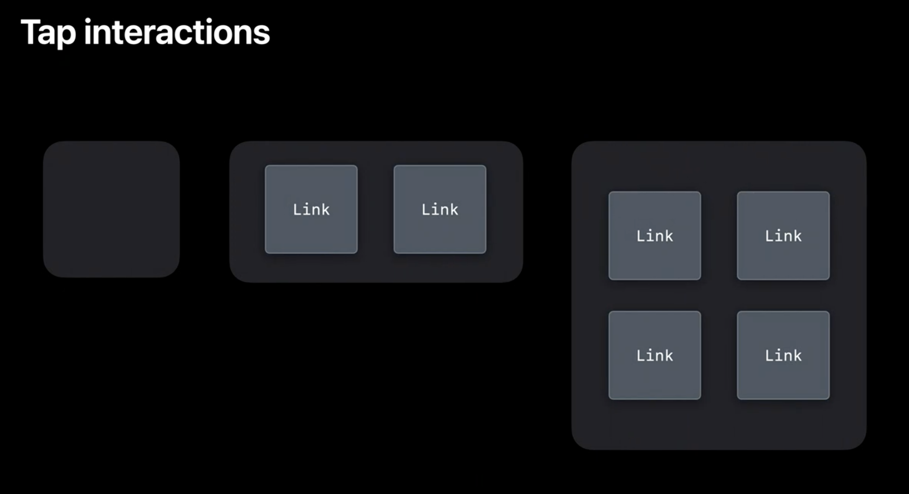

---

layout: post

title: iOS14 Widget指北

tags: [iOS14]

Author: Steve.liu

---


> 2020 年 6 月 22 日，苹果召开了第一次线上的开发者大会 - WWDC20。这次发布会上宣布了ARM架构Mac芯片（~~拳打Intel~~）、iOS 14 ATT（~~脚踢Facebook~~），可谓是一次载入史册（~~我是爸爸~~）的发布会了，当然还发布了被称为下一个顶级流量入口的`Widget`。
>
>踩着八月的尾巴，本次我们就来探究一下Widget。
>
>本文会从`Widget初窥`和`Widget开发`两个维度和章节来探究一下Widget，
>其中`初窥`章节会带您简单的了解一下Widget，适合应用决策者阅读；
>`开发`章节会带着您一步一步的完成设计开发Widget，适合程序员阅读。


# Widget初窥


## 一、Widget是什么


> In iOS 14, we have a dramatic new Home screen experience, one that is much more dynamic and personalized, with a focus on widgets.
> The content is the focus.
>This is very important: `widgets are not mini-apps.`
>Think of this as more projecting content from your app onto the Home screen rather than full mini-apps filled with tiny little buttons.

一句话来说：Widget不是迷你应用程序。而是一种新的主屏幕体验，能快速提供用户关心的内容是重点


<br>

## 二、Widget的特点

- `Glanceable`		一目了然
- `Relevant`			早韭晚菘
- `Personalized`		量体裁衣


要设计一个优秀的Widget，就要先了解Widget的全部特点，了然于胸

针对Apple提出的`Glanceable`、`Relevant`、`Personalized`分别用一个成语来形容就是`一目了然`、`早韭晚菘`、`量体裁衣`

简单来说下这几个特点

<br>

### 1、Glanceable | 一目了然，一览无余


一个优秀的Widget要一目了然，一览无余。

普通人每天进入“主屏幕”的次数超过90次，但是在主屏幕仅停留几分钟，就切换到其他App了。

所以Widget一定要充分利用狭小的屏幕展示最核心的信息，并且要简洁明了。设计新颖，便于快速浏览，高效是一个优秀Widget的核心。

用户不用思考这个Widget怎么使用，不需要点击任何按钮就可以获得最关心的信息。

<br>

### 2、Relevant | 早韭晚菘


苹果希望Widget可以和用户紧密结合，与用户的行为所关联，比如早上起床，用户希望看一下天气；中午恰饭，用户希望有人推荐下附近的美食；晚高峰的时候，用户希望了解一下行车路线；晚安的时候，希望记录下次日的行程。

为此，苹果系统提供了一个叫Smart Stacks（智能叠放）的功能，Smart Stacks是一个Widgets的集合。系统会根据每个人的习惯，自动显示用户当前时间点最需要的Widget。


<div style="align:center"></div>

<br>

### 3、Personalized  量体裁衣

#### 3.1 大小

Widget要能为用户提供个性化的服务，比如天气Widget，需要能为不同的用户提供不同细节的天气情况。


为此Apple提供三种不同大小的小部件

- `systemSmall` 
- `systemMedium` 
- `systemLarge` 

其中systemSmall大小为`2*2 Icon`，systemMedium大小为`4*2 Icon`，systemLarge大小为`4*4 Icon`，具体的显示效果如下


#### 3.2 个性化配置

另一方面Widget需要能为不同城市的用户提供当地的天气情况。

为此Apple在创建Widget时为开发者提供了两种类型：

- `StaticConfiguration` ：对于没有用户可配置属性的窗口小部件,也就是用户无需配置，展示的内容只和用户信息有关系。例如，显示一般市场信息的股市窗口小部件，或显示趋势头条的新闻窗口小部件。

- `IntentConfiguration` ：对于具有用户可配置属性的窗口小部件,也就是支持用户配置及用户意图的推测。您使用SiriKit自定义意图来定义属性。例如，需要一个城市的邮政编码的天气小部件，或者需要一个跟踪号的包裹跟踪小部件。


需要说明的是，IntentConfiguration并不需要编写代码，只需要简单的配置，Xcode 会自动帮你生成对应的代码和类型。

#### 3.3 黑暗模式

此外Widget还支持系统的黑暗模式


<br>

## 三、Widget的本质

Widget的本质是一系列静态视图堆叠而成的集合，不同的时间点展示不同的视图

这里要引入Widget的核心Timeline

顾名思义，Timeline就是一条时间线，在对应的时间点发生对应的事件

许多Widget具有可预测的时间点，在这些时间点更新其内容是有意义的。例如，显示天气信息的小部件可能会在一整天内每小时更新一次温度。股市窗口小部件可以在公开市场时间频繁更新其内容，但周末则不用完全更新。通过提前计划这些时间，生成不同的视图放入时间线中，WidgetKit会在适当的时间到来时自动刷新您的窗口小部件。

这也决定了Widget基本上不能实时更新

另外值得一提的是，WidgetKit会把 Timelines 所定义的Views 结构信息缓存到磁盘，然后在刷新的时候才通过 JIT 的方式来渲染。这使得系统可以在极低电量开销下为众多 Widgets 处理 Timelines 信息。


<br>

## 四、用户交互

不好意思，没有交互！！！

为了实现以上的特点，Apple也移除限制了Widget的一些功能

- 不能交互
- 不能播放动画
- 不能播放视频
- 不支持滚动
- 不支持主动刷新视图

唯一支持的只有用户点击Widget唤起主App


其中点击唤起主App有两种方案，分别是：

- widgetURL
- Link

widgetURL唤起App的点击区域是Widget的所有区域，这种方案适合简单元素，单一逻辑的小部件


对于systemSmall类型的小部件，只支持widgetURL唤起方式


针对`systemMedium `和`systemLarge `还可以使用更细分的Link唤起方式，这种唤起方式能让小部件通过不同元素的点击唤起App的不同页面，让开发者有更多的施展空间



举个简单的例子，widgetURL可应用于天气小部件，博客小部件，点击直达App；

Link可用于备忘录和日历小部件，点击不同的备忘录和日期直接跳转到对应的备忘录详情和待办详情页面


<br>

## Widget初窥总结

Widget的出现犹如在一潭死水的iOS桌面上泛起了一片涟漪，一定会有很多App来争夺这块肥肉一般的流量入口。

但是仔细研究一下会发现，Apple这次推出的Widget非常克制，并没有非常激进，

俗话说：喜欢是放肆,但爱就是克制。这里不得不再次引用Apple在Widget介绍中出现频率最高的话`widgets are not mini-apps`，因为Widget在设计之初就是为了能使用最少的成本，向用户提供最核心的信息。为了尽可能的减少用户成本（电量，网络等）和提高用户体验，Apple在技术层面上做了很多限制，限制了非常多的功能，大大削弱了Widget的地位和重要程度，也降低了开发者实现的热情和积极性

其实每年Apple更新的新技术只有很少的一部分能应用到App上，希望这次的Widget能有动力让大家结合自己的App，给自己的App带来更多的流量，也能给用户带来更好的体验。


***
***

<br>

# Widget开发

重头戏来啦，接下来让我们一步一步设计编写出优秀的小部件吧

开始之前，首先我们要介绍下Widget的开发语言，Apple特别指定了小部件只能使用SwiftUI来开发

## 一、SwiftUI


现在iOS主流的开发语言还是Objective-C，那Apple为什么要选择2019 WWDC发布迄今为止只有一年的SwiftUI呢？

首先，从一开始就将小部件实现多平台化是Apple的一个目标，SwiftUI在跨设备展示的能力上是一把大杀器；

其次SwiftUI还使自动布局和暗模式等功能变得非常容易，降低了适配等开发成本，对不需要太多元素的小部件来说，SwiftUI重点关注布局的特点无疑是最合适的；

从另一方面来讲，只有使用 SwiftUI 才能达到我们上边说的对于 Widget 的限制。如果可以使用 Objective-C UIKit 的话，我们强大的开发者可能会想出无数的黑科技来忽略Apple真的小部件的限制。比如开发无法使用 UIViewRepresentable 来桥接 UIKit；

最后Apple也夹带了自己的私心，Apple今年已经将 Swift 语言和 SwiftUI 的重要程度提升到了一个新的高度，Swift已经可以独立于Foundtion框架，那么对应的SwiftUI也应该不依赖于UIKit框架了，强行使用SwiftUI可以使开发人员尽可能容易地将其学习其内容并应用于iOS，iPadOS和macOS，

毕竟5月份卡位第20位Objective-C在6月份已经跌出了前20


这里要重点说明一下，Widget只要使用任何 UIKit 的元素就会直接 Crash

<br>

## 二、将小部件目标添加到您的应用

窗口小部件扩展模板提供了创建窗口小部件的起点。单个小部件扩展可以包含多种小部件。例如，一个体育应用程序可能有一个显示团队信息的小部件，另一个显示游戏时间表的小部件。一个小部件扩展可以包含两个小部件。尽管建议将所有窗口小部件包含在一个窗口小部件扩展中，但如有必要，可以添加多个扩展。

1. 在Xcode中打开您的应用程序项目，然后选择“文件”>“新建”>“目标”。

2. 从“应用程序扩展”组中，选择“窗口小部件扩展”，然后单击“下一步”。

3. 输入您的包名。

4. 如果窗口小部件提供了用户可配置的属性，请选中`Include Configuration Intent`复选框。

单击完成。


> 重点：小部件不仅支持Swift项目，同样也支持Objective-C项目，OC小伙伴不用担心啦


创建完小部件之后，我们会多出一个SmileEverydayWidget.swift文件，这已经是一个可以run起来的小部件了，因为我们接下来要逐个方法来分析，所以先将文件全文展示如下


```
//
//  SmileEverydayWidget.swift
//  SmileEverydayWidget
//
//  Created by steve on 2020/8/28.
//

import WidgetKit
import SwiftUI

struct Provider: TimelineProvider {
    public typealias Entry = SimpleEntry

    public func snapshot(with context: Context, completion: @escaping (SimpleEntry) -> ()) {
        let entry = SimpleEntry(date: Date())
        completion(entry)
    }

    public func timeline(with context: Context, completion: @escaping (Timeline<Entry>) -> ()) {
        var entries: [SimpleEntry] = []

        // Generate a timeline consisting of five entries an hour apart, starting from the current date.
        let currentDate = Date()
        for hourOffset in 0 ..< 5 {
            let entryDate = Calendar.current.date(byAdding: .hour, value: hourOffset, to: currentDate)!
            let entry = SimpleEntry(date: entryDate)
            entries.append(entry)
        }

        let timeline = Timeline(entries: entries, policy: .atEnd)
        completion(timeline)
    }
}

struct SimpleEntry: TimelineEntry {
    public let date: Date
}

struct PlaceholderView : View {
    var body: some View {
        Text("Placeholder View")
    }
}

struct SmileEverydayWidgetEntryView : View {
    var entry: Provider.Entry

    var body: some View {
        Text(entry.date, style: .time)
    }
}

@main
struct SmileEverydayWidget: Widget {
    private let kind: String = "SmileEverydayWidget"

    public var body: some WidgetConfiguration {
        StaticConfiguration(kind: kind, provider: Provider(), placeholder: PlaceholderView()) { entry in
            SmileEverydayWidgetEntryView(entry: entry)
        }
        .configurationDisplayName("My Widget")
        .description("This is an example widget.")
    }
}

struct SmileEverydayWidget_Previews: PreviewProvider {
    static var previews: some View {
        /*@START_MENU_TOKEN@*/Text("Hello, World!")/*@END_MENU_TOKEN@*/
    }
}
```

这里的概念和代码比较多，接下来我们一个一个来解释

<br>

## 三、Widget API

首先我们从带有`main`字段的方法来说起，

```
@main
struct SmileEverydayWidget: Widget {
    private let kind: String = "com.steve.liu.smileEverydayWidget"

    public var body: some WidgetConfiguration {
        StaticConfiguration(kind: kind, provider: Provider(), placeholder: PlaceholderView()) { entry in
            SmileEverydayWidgetEntryView(entry: entry)
        }
        .configurationDisplayName("My Widget")
        .description("This is an example widget.")
        .supportedFamilies([.systemSmall, .systemMedium, .systemLarge])
    }
}
```

大家都知道带有`main`标识的方法都是程序的入口

这段代码使用SwiftUI声明了一个名为SmileEverydayWidget的小部件，其中`StaticConfiguration`是小部件的初始化方法，它有几个参数：

1. `kind`
2. `provider`
3. `placeholder`


其中

`kind`是`标识小部件的字符串,并且应描述小部件所代表的内容。即小部件的包名`

`provider`为`时间线提供者`

`PlaceholderView`为`占位视图`

同时也提供了一些方法，例如

- `configurationDisplayName()`设置小部件显示的名称
- `description()`设置小部件的描述
- `supportedFamilies()`设置小部件支持的尺寸

> 这里有一个重点，为了使某个应用程序的窗口小部件出现在窗口小部件库中，用户必须在安装该应用程序后至少启动一次包含该窗口小部件的应用程序。

<br> 

## 四、WidgetEntryView

WidgetEntryView就是使用SwiftUI布局的小部件视图

```
struct SmileEverydayWidgetEntryView : View {
    var entry: Provider.Entry

    var body: some View {
        Text(entry.date, style: .time)
    }
}
```

例如这个小部件视图就简单的展示了当前的时间

接下来我们可以将默认的布局更改为我们自己想要的布局，例如我在设置了显示文本的字体和小部件的背景图

```
struct SmileEverydaWidgetEntryView : View {
    var entry: Provider.Entry

    var body: some View {
        
        return Text(entry.message)
            .background(Image(entry.backgroundImageStr))
            .font(.callout)
    }
}
```

<br>

## 五、PlaceholderView

每种小部件都需要提供占位符UI。

占位符UI是窗口小部件的默认内容。

它应该代表您的小部件类型，但仅此而已。

此用户界面中不应有任何用户数据。


想象一下

如果在用户的主屏幕上出现如下的场景，那么你的小部件离被移除可能已经不远了


<br>

## 六、TimelineEntry

我们知道小部件是按照时间线来展示的，`TimelineEntry`时间线上的一个个条目

```
struct SimpleEntry: TimelineEntry {
    public let date: Date
}
```

TimelineEntry有一个必须有的属性就是`date`，也就是这个条目在时间线上的具体时间

另外开发者可以在TimelineEntry里自定义各种属性，用来给小部件视图提供数据

例如我在TimelineEntry里自定义了`message `和`backgroundImageStr `属性，用来显示小部件上的文字和背景图片

```
struct SimpleEntry: TimelineEntry {
    public let date: Date
    public let message: String
    public let backgroundImageStr : String
}
```

## 七、TimelineProvider

`TimelineProvider` 是一个提供了上述我们所说的`TimelineEntry`集合的对象


我们来看下具体的代码：

```
struct Provider: TimelineProvider {
    public typealias Entry = SimpleEntry

    public func snapshot(with context: Context, completion: @escaping (SimpleEntry) -> ()) {
        let entry = SimpleEntry(date: Date())
        completion(entry)
    }

    public func timeline(with context: Context, completion: @escaping (Timeline<Entry>) -> ()) {
        var entries: [SimpleEntry] = []

        // Generate a timeline consisting of five entries an hour apart, starting from the current date.
        let currentDate = Date()
        for hourOffset in 0 ..< 5 {
            let entryDate = Calendar.current.date(byAdding: .hour, value: hourOffset, to: currentDate)!
            let entry = SimpleEntry(date: entryDate)
            entries.append(entry)
        }

        let timeline = Timeline(entries: entries, policy: .atEnd)
        completion(timeline)
    }
}
```

其中包含两个方法

- snapshot()
- timeline()

#### 1、snapshot 快照

为了在小部件库中显示小部件，WidgetKit 要求提供者提供预览快照， 即`snapshot()`，这个方法里主要提供了一些`示例数据，最好是真实数据`，用于`时间线不能展示`的时候展示给用户

需要说明的是，快照是系统需要快速显示单个条目的位置。

因此，您的扩展程序必须尽快返回视图，因为这样做时，用户会在iOS上漂亮的Widget Gallery中看到真正的Widget。

这不是我们在设计时必须提供的屏幕截图或图像。这是用户在iOS，iPadOS和macOS上真正的小部件体验。

在大多数情况下，时间轴的第一个条目和快照可以作为同一条目返回，因此，在“小工具库”中看到的就是用户将其添加到设备中时得到的内容。


例如我们在Widget Gallery中添加电池小部件时，小部件此时在Widget Gallery中展示的就是当前设备电池信息的实时数据的快照，而不是一些虚假的数据，这个时候小部件的数据是什么样子，用户添加到主屏幕上之后小部件的数据就是什么样子，从而提高用户的体验。

> 对比

小部件里有两个比较类似的概念，`PlaceholderView`和`snapshot`，都是一种占位解决方案，不同的是`PlaceholderView`是在主屏幕上无法快速获取数据时的一种占位视图，不至于显示loading或者白屏给用户看；而`snapshot`主要用于`Widget Gallery`中，用来提高用户体验的，一般来说，`snapshot `就是时间线的第一帧

#### 2、timeline

在请求初始快照后，WidgetKit调用`timeline`以请求提供者的常规时间轴。时间轴由一个或多个时间轴条目`TimelineEntry`以及一个重载策略`ReloadPolicy`组成，该重载策略通知WidgetKit何时请求后续时间轴。

关于重载策略，提供了以下几种策略

- `atEnd`: 是指 Timeline 执行到最后一个时间片的时候再刷新。
- `atAfter`: 是指在某个时间以后有规律的刷新
- `never`：是指以后不需要刷新了。什么时候需要重新刷新需要 App 重新告知 Widget

根据上边的分析，我们可以将`TimelineProvider `改造如下

```
struct Provider: TimelineProvider {
    public typealias Entry = SimpleEntry

    public func snapshot(with context: Context, completion: @escaping (SimpleEntry) -> ()) {
        let date = Date()
        let message = "蒹葭苍苍，白露为霜。所谓伊人，在水一方。"
        let backgroundImageStr = "bg7"
        
        
        let entry = SimpleEntry(date: date, message: message, backgroundImageStr: backgroundImageStr)
        completion(entry)
    }

    public func timeline(with context: Context, completion: @escaping (Timeline<Entry>) -> ()) {
        var entries: [SimpleEntry] = []
        
        var currentDate = Date()
        var nextUpdateDate = Calendar.current.date(byAdding: .second, value: 3, to: currentDate)!
        
        let message = "蒹葭苍苍，白露为霜。所谓伊人，在水一方。\n溯洄从之，道阻且长；溯游从之，宛在水中央。\n蒹葭凄凄，白露未晞。所谓伊人，在水之湄。"
        let backgroundImageStr = "bg"
        
        
        let formatter = DateFormatter()
        formatter.dateFormat = "yyyy-MM-dd HH:mm:ss"
        var currentDateStr = ""
        var nextUpdateDateStr = ""

        let longUuid = UUID().uuidString
        let range: Range = longUuid.range(of: "-")!
        let location: Int = longUuid.distance(from: longUuid.startIndex, to: range.lowerBound)
        let uuid = longUuid.prefix(location)
        
        for i in 1 ..< 10 {
            
            var msg = ""
            
            currentDate = nextUpdateDate;
            nextUpdateDate = Calendar.current.date(byAdding: .second, value: 3, to: currentDate)!
            
            currentDateStr = formatter.string(from: currentDate)
            nextUpdateDateStr = formatter.string(from: nextUpdateDate)
            
            msg.append(message)
            msg.append("\n时间轴ID " + uuid);
            msg.append("\n时间轴第" + String(i+1) + "个视图")
            msg.append("\n本次视图开始时间 " + currentDateStr)
            msg.append("\n下次视图开始时间 " + nextUpdateDateStr)
            
            let entry = SimpleEntry(date: currentDate, message: msg, backgroundImageStr: backgroundImageStr+String(i))
            
            entries.append(entry)
            print(String(i))
        }
        
        let timeline = Timeline(entries: entries, policy: .atEnd)
        completion(timeline)
    }
}
```

这段代码里我们提供了一个古诗词的快照

并生成了一个时间线，其中时间线里包含了`10个entry，且每个entry 间隔10s`

entry文本拼接显示了

- 展示文本（诗经）
- 时间轴ID
- 本次视图开始时间
- 下次视图开始时间

下边我们来看一下真实run出来的效果


到此为止我们就有了一个可以在主屏幕上展示的小部件了

并且能根据时间线展示不同的视图了。

<br>

## 七、Reload Timeline 使小部件保持最新

为了使我们的小部件能随时提供最新的，而不是过期的信息，我们需要不时的对小部件进行更新。

我们已经知道了小部件的本质是一系列的视图堆叠，那么更新小部件就是更新这些视图。


比如一个有三个视图的小部件，预测了现在和未来3小时的天气预报，这个小部件显示步骤如下：


但是有一个很重要的问题就是时间线是我们预测出来的，是预测就会有偏差。比如天气预报，预报2小时后有雨，但是随着天气的变化，2小时后变成晴天了，这个时候我们如果不更新小部件上的时间线，就会在2小时后给用户提供错误的信息。

为此我们需要在有信息变化的时候重新显示新的视图，如下图：


为了是我们的小部件信息准确无误，首先我们需要了解下小部件是如何刷新的

很不幸，`Widget 的刷新完全由 WidgetCenter控制`。开发者无法通过任何 API 去主动刷新 Widget 的页面，只能告知 WidgetCenter，`Timeline 需要刷新了`

所以我们不能直接刷新小部件的视图，而是要通过生成一个新的时间线来替换旧的时间线，Reload Timeline 并不是直接刷新 Widget，而是 WidgetCenter 重新向 Widget 请求下一阶段的数据。

其中`Reload Timeline`分为两种方式

- System Reloads
- App Reloads

#### 1、System Reloads

这个行为由系统主动发起，会调用一次 Reload Timeline 向 Widget 请求下一阶段刷新的数据。系统除了会按时发起 System Reloads 之外，还会动态决策每个不同的 TimeLine 的 System Reloads 的频次。比如被点击次数很大程度上直接决定了 System Reloads 的频率，点击率越高，更新频次越快，当然还有一些由于设备环境变化触发的行为也会触发 System Reloads，比如设备时间进行了变更。


很显然这种方案不能很好的解决我们上边的问题

#### 2、App Reloads

这种行为指的是App主动通知小部件，你需要更新信息了。这里边根据App的当前的前后台状态又分为两种方式

- 应用在前台运行
- 应用在后台运行

当应用在前台运行的时候，App 可以直接使用WidgetCenter的 API 来 Reload Timeline；而当应用处于后台时，可以使用后台推送（Background Notification）来 Reload Timeline。


除了这些，给Timeline设定合适的刷新策略也是很重要的手段

合理的组合使用这些刷新机制，能够极大的提高Widget信息的准确性


<br>

## 八、交互

前边我们说过，widget和app交互有两种方式`SwiftUI widgetURL API`和`SwiftUI Link API`

这两种方式的本质都是`URL Schemes`，只要监听`SceneDelegate`的`scene:openURLContexts:`就可以了

由于Schemes大家都太熟悉了，关于如何高效快速准确的传递参数，这里就不展开讲了。


<br>

## 九、设计漂亮的小部件

如果你已经看到了这里，并且已经理解了上述的讲解，你已经具备了开发小部件的能力。

那么有哪些关键点能给自己的小部件锦上添花呢？

`去除额外的App信息`：系统会在小部件下方自动显示你的应用名称，因此你无需在内容中重复App的名称，Icon，而是要通过颜色，布局和图像来联系您的App

`简洁的描述`。小部件库中显示的描述可以帮助人们理解每个小部件的功能。从动作动词开始描述通常效果很好；例如，“查看当前天气状况和位置预测”或“跟踪即将举行的活动和会议”。避免包含不必要的短语来引用窗口小部件本身，例如“此窗口小部件显示...”，“使用此窗口小部件...”或“添加此窗口小部件”。

`舒适的信息密度`：一览无余。当内容显得稀疏时，小部件可能看起来是多余的；当内容太密集时，小部件将无法浏览。如果要包含很多信息，请避免让小部件成为难以解析的项的拼贴。寻求整理内容的方法，以便人们可以立即掌握关键部分，并以更长的时间查看相关细节。您可能还考虑创建一个较大的小部件，并寻找可以用图形替换文本而又不会失去清晰度的位置。

`明智地使用颜色`：丰富，美丽的色彩吸引眼球，但它们绝不能阻止人们一眼就吸收小部件的信息。使用颜色可以增强小部件的外观，而不会与小部件的内容竞争。

`使用系统字体，支持系统功能`：例如 支持黑暗模式；使用SF Pro和使用系统字体；文本可缩放。


`设计一个真实的预览以显示在小部件库中`：突出显示小部件的外观和功能可帮助人们做出明智的决定，并鼓励他们添加小部件。您可以在小部件预览中显示真实数据，但是如果数据生成或加载所需的时间太长，请显示真实的模拟数据。

`设计占位符内容，以帮助人们识别您的小部件`。小部件在加载数据时显示占位符内容。通过将UI的静态部分与代表实际内容的半透明形状结合起来，可以创建有效的预览。例如，您可以使用不同宽度的矩形来建议文本行，并使用圆环或正方形代替字形和图像。


`图片适配屏幕尺寸`：确保图片在大部件和小部件下都不会压缩


<br>

## 十围之木，始生如蘖

简单的总结一下

一个优秀的小部件是完全可以提高用户体验，成为很好的流量入口，给App带来巨大的商业价值。

但是要设计一个优秀的小部件也并非易事。

本文抛砖引玉，希望大家能设计出更多优秀的小部件。

本次的Widget指北到这里就结束了，万字不易，多多传播。

喜欢我你就关注我,

有话说你就评论我,

都不干你就点个赞


<br>

Demo

- [SmileEveryday](https://github.com/guojunliu/Widget)

<br>

参考

- [Meet WidgetKit](https://developer.apple.com/videos/play/wwdc2020/10028/)
- [Human Interface Guidelines](https://developer.apple.com/design/human-interface-guidelines/ios/system-capabilities/widgets/)
- [Creating a Widget Extension](https://developer.apple.com/documentation/widgetkit/creating-a-widget-extension)
- [Keeping a Widget Up To Date](https://developer.apple.com/documentation/widgetkit/keeping-a-widget-up-to-date)
- [Apple Widget：下一个顶级流量入口？](https://mp.weixin.qq.com/s?__biz=MzAxNDEwNjk5OQ%3D%3D&idx=1&mid=2650409113&scene=21&sn=8da77e73f42e4d24ae20f6a86dfa5a4a#wechat_redirect)
