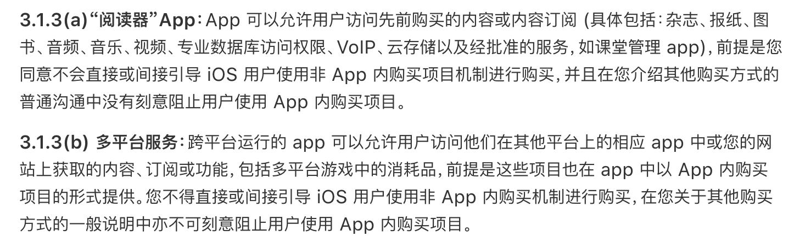
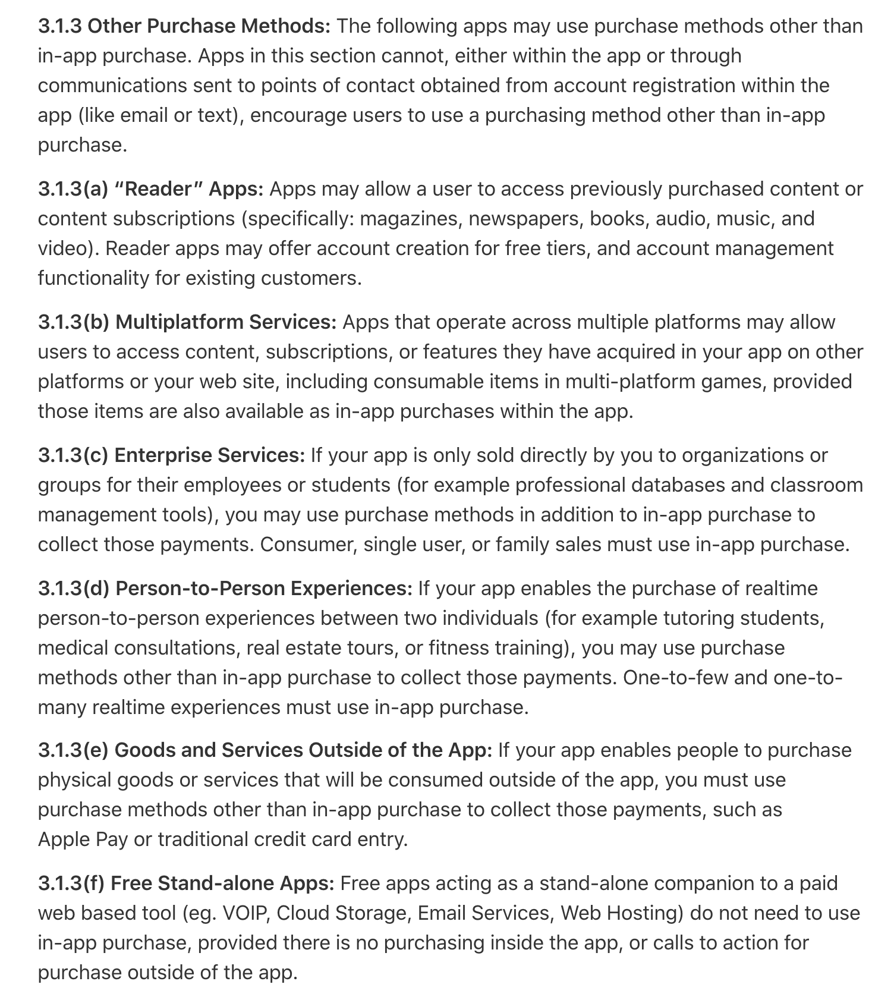

---

layout: post

title: 苹果今年再次更新App Store审核指南，放宽App内购限制

tags: [IAP]

Author: Steve.liu

---

>2020年9月11日，苹果更新了App Store审核指南，这也是进入2020年后，苹果第二次更新其审核指南。这次更新的主要内容包括App Clip、App内购买、云游戏等多个方面。

其中，苹果放宽了对App内购的限制。

## 旧版本审核指南

首先看一下旧版本审核指南（2020/3/4）中可以不使用App内购的情况：

其中可以不使用App内购，而使用其他方式支付的情况只有两种，分别是：

- 阅读器
- 多平台服务

## 新版本审核指南

接下来看一下新版本的审核指南（2020/9/11）中可以不使用App内购的情况：

其中可以不使用App内购，而使用其他方式支付的情况有6种，分别是：

- Reader 阅读器
- Multiplatform Services 多平台服务
- Enterprise Services 企业服务
- Person-to-Person Experiences 一对一体验
- Goods and Services Outside of the App 应用程序外的商品和服务
- Free Stand-alone Apps 免费的独立应用程序

## 放宽了App内购限制

对比下来我们会发现新版的多出了4项可以不使用内购的情况。

Apple还特别说明了产品方不得主动鼓励或暗示用户可到第三方支付的地方进行购买。

Apple针对阅读App、跨平台服务、企业服务、一对一体验、免费独立App等不同平台和业务模式进行了单独的详细说明。

 

喜欢我你就关注我,

有话说你就评论我,

都不干你就点个赞

