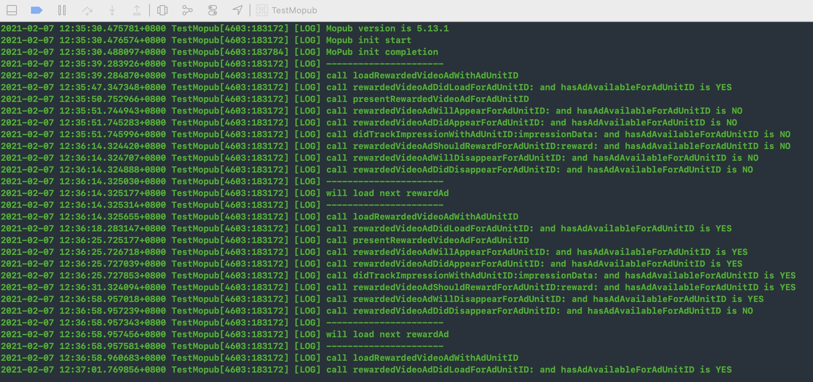
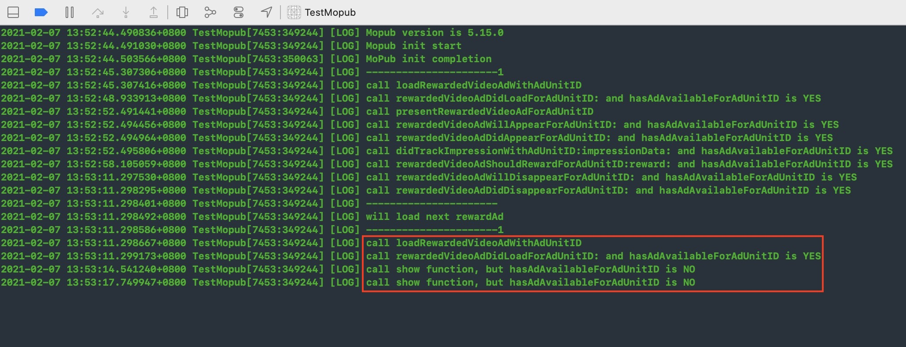
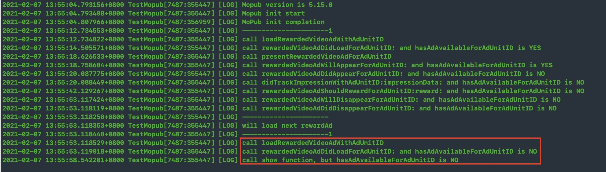
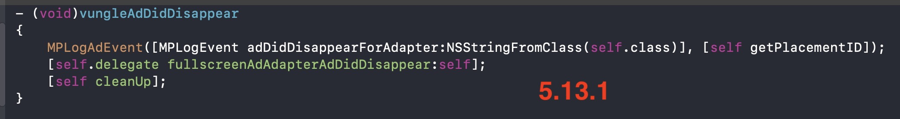
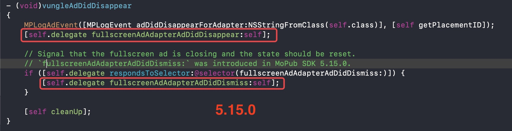
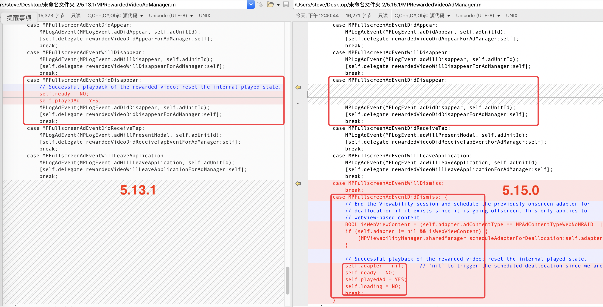

---

layout: post

title: Mopub update issues （5.13.1 to 5.15.0）

tags: [Mopub]

Author: Steve.liu

---

Mopub update issues （5.13.1 to 5.15.0）

目的：在广告关闭之后立刻加载一个新的广告

步骤：
在`MPRewardedVideoDelegate`的`rewardedVideoAdDidDisappearForAdUnitID`回调中，调用`loadRewardedVideoAdWithAdUnitID:withMediationSettings:`方法

这在5.13.1版本中是没有问题的，

但是在5.15.0版本中，这是有问题的，虽然告诉我广告已经加载成功，但是在我准备展示广告的时候，却发现`hasAdAvailableForAdUnitID is fasle`

Log：

- 5.13.1




- 5.15.0
 




当我对比了5.13.1和5.15.0两个版本的代码发现，Reset ad state的流程有所改变

5.13.1 先reset，然后callback

- 1、Reset ad state
- 2、call rewardedVideoAdDidDisappearForAdUnitID:

5.15.0 先callback，然后reset

- 1、call rewardedVideoAdDidDisappearForAdUnitID:
- 2、Reset ad state

code:






这导致了我在`rewardedVideoAdDidDisappearForAdUnitID `中继续调用`loadRewardedVideoAdWithAdUnitID:withMediationSettings:`方法时，广告的状态是没有重置的，在判断`if (self.ready && !self.playedAd)`时为true

```
- (void)loadRewardedVideoAdWithCustomerId:(NSString *)customerId targeting:(MPAdTargeting *)targeting
{
    MPLogAdEvent(MPLogEvent.adLoadAttempt, self.adUnitId);

    if (self.ready && !self.playedAd) {
        [self.delegate rewardedVideoDidLoadForAdManager:self];
    } else {
        self.customerId = customerId;
        self.targeting = targeting;
        [self loadAdWithURL:[MPAdServerURLBuilder URLWithAdUnitID:self.adUnitId targeting:targeting]];
    }
}
```

但是广告并没有真的去加载。

[复现Demo](https://github.com/guojunliu/MopubIssuesDemo)
