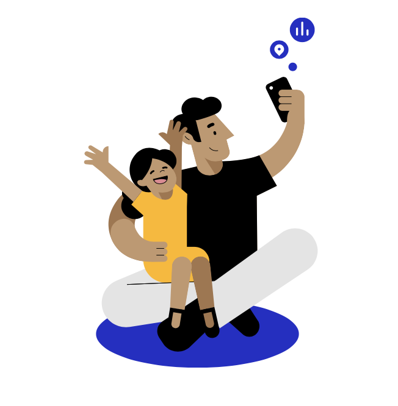
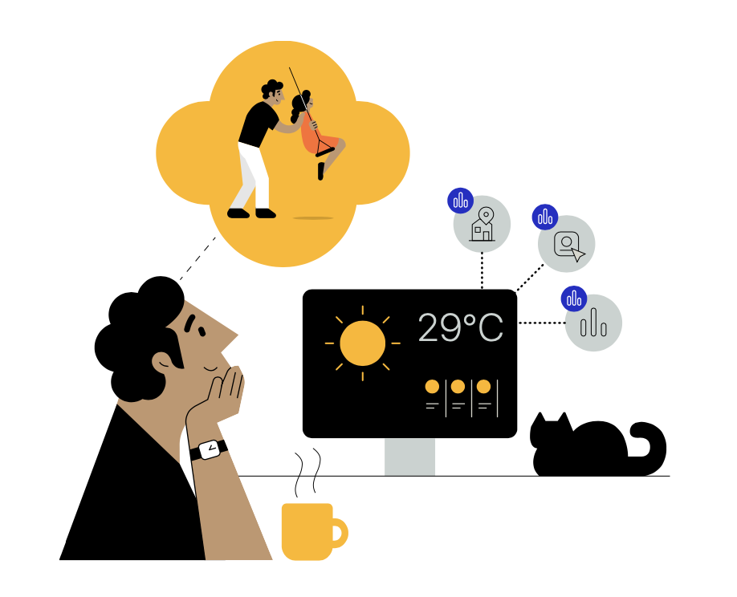
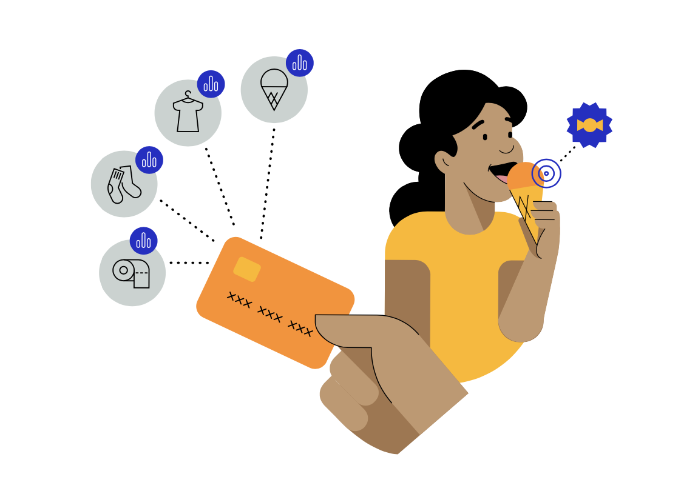
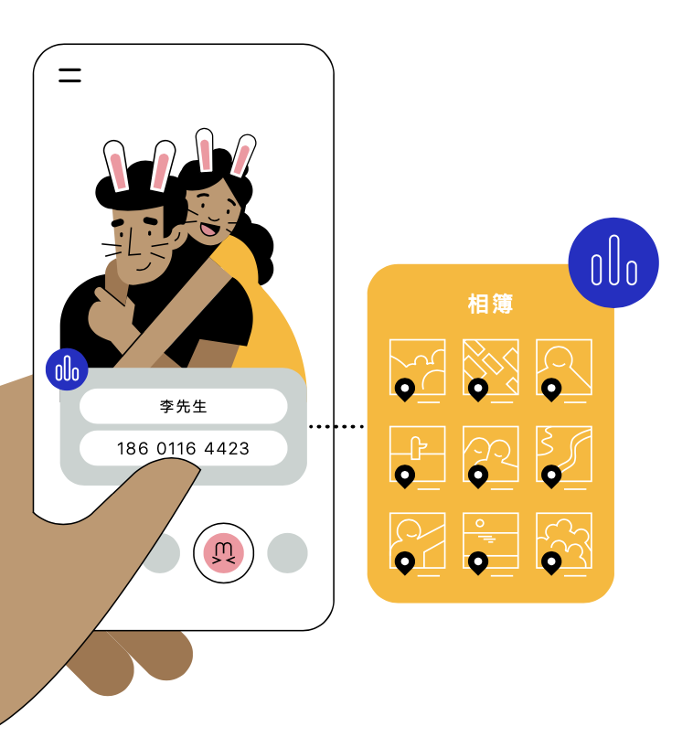
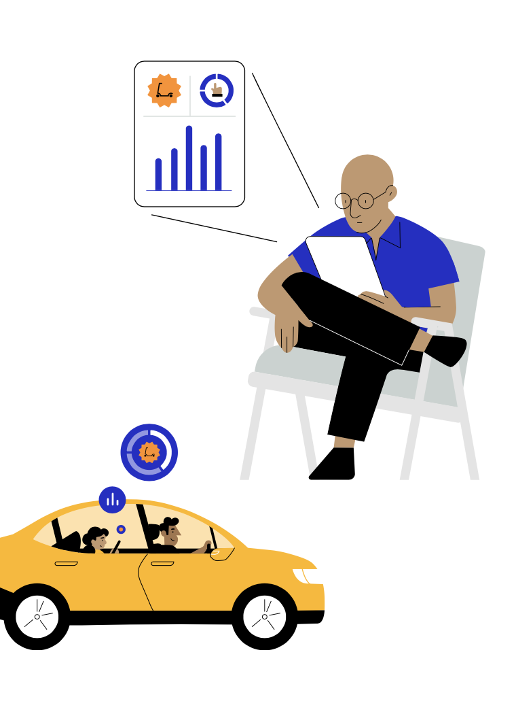

---

layout: post

title: 个人数据的一天

tags: [privacy]

Author: Steve.liu

---

>  “我相信人都是聪明的，有些人也愿意分享更多数据。 这就要征询他们的同意，每一次都征询。就算他们厌倦了，也得让他们来告诉你不必再问了。而且你要确切地 告诉他们，你会怎样使用他们的数据。”
> 
>  Steve Jobs
> 
>  2010 年，万物数字化大会 (All Things Digital Conference)

### 十年来，一个庞大而不透明的产业在持续收集越来越多的个人数据。

这个由网站、app、社交媒体公司、数据代理商和广告技术公司组成的复杂生态系统，在线上和线下跟踪用户，并采集他们的个人数据。这些数据被拼凑、分享、汇总，并用于实时竞拍，滋生出一个年产值高达2270 亿美元的产业^1 。在日常生活中，这样的事每天都在上演，而人们往往不知就里，或未予准许。让我们来看看，在一对父女本应很愉快的公园一日游

### 期间，这一产业都能了解到多少关于他们的信息。

##### 你知道吗？

**跟踪器就内嵌在你每天使用的 app中：每一款 app 平均含有 6 个跟踪器。** 大多数热门的 Android 和 iOS app 中都含有嵌入式跟踪器。

跟踪器通常会被嵌入到可帮助开发者构建 app 的第三方代码中。 通过添加追踪器，开发者还允许第三方对你在不同 app 中与其共享的数据进行收集，并与已收集到的其他关于你的数据相关联。

数据代理商收集、出售、许可，或以其他方式向第三方披露个人信息， 而他们与被采集信息的特定人群并无直接联系。

## 李先生计划与女儿在公园游玩一天

这一天，李先生想带他 7 岁的女儿迎迎去玩玩。早上，李先生使用电脑查询天气，然后用智能手机上的一款地图类 app 查看交通状况，准备前往女儿学校附近的游乐场。前往途中，他的手机上有 4 款 app在后台定时收集并跟踪着他们的位置数据 。从设备中提取数据后，这些app 的开发者将数据
出售给李先生从未听说过的众多来历不明的第三方数据代理商。虽然收集的位置数据号称是匿
名的，但通过跟踪用户，数据代理商就能将李先生在这些 app 中的历史位置与他在使用其他 app 时
被收集的信息进行匹配 。这就意味着，跨 app 及多来源跟踪而获取的信息，能被任何公司或组织
购买，并用于建立一份包括了精确日常活动的个人档案。

### 迎迎在去公园的路上玩了一个游戏

在去游乐场的途中，李先生允许女儿在他的平板电脑上玩一个游戏。当她打开 app 时，看到了一则滑板车广告，而这并非偶然。在 app 载入的瞬间，广告位已开始竞拍 。通过中介，滑板车公司的广告代理公司了解到有可用的广告位。随后，再利用收集到的李氏父女相关个人数据，参与广告竞价。滑板车公司的广告合作方会继续收集父女俩在看到广告后的行为信息，以确定他们是否点击了广告，或购买了滑板车。并且，还会继续通过李先生在所有设备上安装的各种 app和浏览的各类网站来跟踪这对父女，千方百计地向他们推送滑板车广告。

**数以百计的数据代理商在线上和线下都在采集数据。** 其中，某家代理商收集了全球 7 亿消费者的数据，并建立了具备多达 5000 种特征描述的消费者档案。

**每一天的每个小时中，在网络上向用户展示的数字广告数以亿计。** 在广告加载所需的几毫秒内，就会进行实时竞拍，此时广告商通常就根据跟踪得到的个人数据对广告位展开竞价14，15。

**一项研究发现，在近 20% 的儿童类app 中，开发者在收集和分享个人身份信息时** 未核实家长是否同意 **。**

### 归途中进了一家冷饮店

回家路上，李先生和迎迎去买冰激凌吃，李先生用信用卡付了款。于是，商店位置和消费金额这两项
信息便被添加到了他的个人喜好综合数据档案中。在跟踪李先生位置的 app 中，有一款能够
观察到李先生和迎迎还顺道去了一家玩具店。关于他们一天中所到之处的信息，会被传送给数据
代理商，再加上已知李先生有一个年幼孩子，这些代理商就会在李先生的设备上密集投放针对性的
糖果零食以及他们到访过的玩具店的广告。

### 李先生和迎迎在公园自拍

随后，李先生和迎迎在游乐场自拍了一张照片。他们使用了一款滤镜 app，最后决定在照片上加对兔耳朵。然而，这款滤镜 app 能够访问设备上的所有照片及其附属元数据，而不仅仅是这张游乐场的自拍照。当李先生在一个社交媒体 app 上发布这张照片时，这款 app就通过电子邮件地址、电话号码或广告标识符，将李先生当前的在线活动与其他 app 收集到的大量数据关联起来，如他的个人背景和购买习惯 。

**有些 app 要求接触的数据范围，远超其提供服务所需，** 例如输入法类 app 要求访问精确的定位信息。

**数据代理商利用其获取的数据为用户指定属性，并极为精细地将用户划入不同的细分市场，** 比如“试图减肥但仍热爱烘焙食品”的人群 。但这些档案往往错误百出。一项研究发现，其中超过 40% 的
属性并不准确。

**信息交换可能会流向广告网络、广告发布者、归因和监测服务提供商、数据代理商、其他私有公司，甚至是政府机构。**由于将个人数据用于收集信息时所明示的用途之外，已有多家社交媒体和广告技术公司面临着或已支付数百万美元的罚款。

一天下来，遍布全球的多家公司都更新了关于父女俩的信息档案，而李先生却从未跟他们打过交道。 这些公司知道这家人的住所位置、他们去过的公园、阅读过的新闻网站、浏览过的产品、看过的广告、购物的习惯，以及到访过的商店3，34。这些数据都是通过李先生父女两人这一整天内用过的多款 app以及其他来源收集和跟踪到的。李先生不知道这一天中被收集了多少数据，也并非始终都能自行管控这些数据，更不曾有意允许这些收集行为的发生， 而当他们在智能电视上的 app 中搜索儿童电影好在晚上看时，跟踪、数据交换、竞拍和目标重定位还在无休止地继续循环着35，36。

## Apple 的隐私原则

Apple 坚信隐私权是一项基本的人权。在产品和服务的设计过程中，我们始终遵循四大
隐私原则：

- 数据最小化

	仅采集提供特定服务所必需的最低数据量。

- 给予用户透明度和管控权

	确保用户知道哪些数据是被共享的、这些数据将被如何使用，并保证用户可以管控这些数据。

- 在设备端进行处理

	尽可能地在设备上处理数据，而不是将数据发送到 Apple 服务器，从而保护用户隐私，最大限度减少数据收集。

- 安全

	软硬件协同工作，保证数据安全。
	

通过这四项原则，Apple 的目标始终是让用户依照自己的意愿，以安全、易懂，并可控的方式
分享数据。这就是为什么二十年来 Apple 不断创新，致力于通过公司的全线产品和服务来保护
用户隐私。例如，我们采用了设备端智能技术以及其他功能，以最大限度地减少我们在 app、
浏览器和在线服务中收集的数据。同时，我们也不会通过我们的所有 app 和服务来创建一套
综合性用户数据档案。

- 想要进一步了解 Apple 已推出的隐私保护功能，以及 Apple 在保护用户隐私方面所做的努力，请访问apple.com.cn/privacy。

- 想要进一步了解 Safari 浏览器如何保护你的隐私，请阅读《Safari 浏览器白皮书》。

- 想要进一步了解 Apple 如何保护你的位置数据，请阅读《定位服务白皮书》。

#### Apple 的隐私功能可让李先生更清晰地了解并管控自己的数据。

李先生和迎迎这一天的经历，体现了 Apple 正在致力研究的隐私问题和解决方案。

## 李先生计划与女儿在公园游玩一天

如果李先生在电脑上使用 Safari 浏览器查看天气情况，默认状态下智能防跟踪功能就会阻止跟踪行为。如果李先生使用 Apple 的地图 app 查询交通信息，他的位置数据将与一个随机标识符相关联，而且这个标识符是定期重置的，也不会关联到李先生。因此，除了李先生本人，没有人会得知他的位置。在 iPhone 上，李先生会收到周期性提醒，告知他哪些 app 正在后台访问他的位置信息。在将位置分享给
app 前，李先生还可以选择只分享自己的大概位置，或只分享一次位置信息。

### 迎迎在去公园的路上玩了一个游戏

在 iPad 上即将推出一项 App 跟踪透明度功能，它可让李先生选择是否允许游戏在其他公司的 app 和网站上跟踪迎迎的活动。采用 Apple SKAdNetwork API 的广告网络，不用接触会追溯到李先生设备的信息，就能衡量广告的整体效果。

### 李先生和迎迎在公园自拍

在 iPhone 上，李先生可以选择让滤镜 app 只能访问该自拍照，而不是整个照片图库。

### 归途中进了一家冷饮店

如果李先生使用 Apple Pay 来购买冰激凌，Apple 会采用设备端智能技术，让他能在 iPhone 上查看自己的交易记录，而 Apple 却不会得知他的购物地点、所购商品或消费金额等情报。

归根结底，在 Apple 的产品及各项隐私功能的帮助下，李先生在这一整天里时刻都能看到更透明的信息，更好地进行管控，并充分了解自己的数据有多少被分享以及被如何使用。

## App 跟踪透明度功能和 App Store 中新的隐私权限说明板块

Apple 正在进一步采取措施，致力于在整个 app 生态系统范围内保护用户的隐私。 随着访问、跟踪人消费者数据并借此获利的群体日益庞大且复杂，Apple 正着手推出两项新功能，旨在提高透明度，赋予用户更多的知情权和选择权，让他们在充分知情的情况下进行选择，并能更好地掌控自己的隐私。

在我们即将推出的测试版更新中，App 跟踪透明度功能将会要求 app 必须先获得用户的许可，才能在其他公司的 app 或网站中跟踪用户数据。 在“设置”中，用户可以查看哪些 app 已申请跟踪许可，从而按照自己认为合适的方式进行更改。这项要求会在初春发布的 iOS 14、iPadOS 14 中广泛推行，并已获得了世界各地隐私权倡导者的支持。在此功能的设计中，Apple 尝试给予用户更好的透明度和管控权，同时继续将广告投放用作支持 app 和网站内容的适当与可行手段。诸如 Safari 浏览器的智能防跟踪等此前推出的功能，已证明在加强用户隐私保护的同时，广告仍可获得理想的效果。App 跟踪透明度功能让用户在充分知情的情况下，对他们使用的 app 以及授予这些 app 的权限进行选择。有了 App 跟踪透明度功能，用户现在可以选择是否允许 app 跟踪他们。对于用户信任并允许跟踪的 app，开发者可以继续跟踪。

除了要求跟踪须征得用户同意之外，Apple 最近还更新了 App Store 产品页面，以进一步提升透明度。得益于新的 App 隐私权限说明板块，App Store 帮助用户更好地了解 app 隐私处理的部分方式。每一款app 的产品页面都必须为用户提供一份可轻松查看的简报，帮助他们了解开发者的隐私处理方法。详情页面包含此 app 收集的数据类型，如照片、位置和联系信息。这些页面还为用户提供更多细节，告知他们此app 的开发者如何使用每一类信息，诸如是否用于跟踪，以及数据是否与用户关联。包括 Apple 在内的所有 app 开发者都必须自行报告关于其隐私处理方法的信息。

新增的 app 跟踪设置和透明度功能，以及 App Store 产品页面上的隐私权限说明，可让用户更轻松地了解自己的个人数据会被如何使用，揭示以前不透明的和隐蔽性的做法，从而帮助他们更好地管控自己的数据。

未来，Apple 将继续开发创新隐私保护技术，并不断探索各种新途径，以保障你个人信息的安全。

## 广告的一天

#### 广告竞拍

迎迎在李先生的设备上看到滑板车广告，并非偶然。广告商为了在设备上展示自己的广告，会在竞拍中出价 。我们来做个简单说明，看看设备屏幕上展示的广告是如何在瞬间被选择出来的：

1.迎迎所使用 app 的开发者聘请广告技术公司来实时拍卖广告位。

2.当迎迎打开该 app 时，广告网络会根据李先生的广告 ID 或其他可跟踪的信息，从所用的李先生设备和第三方收集数据 (例如，她正在使用哪款 app、她所在的位置以及李先生的广告 ID) 。

3.广告网络会与潜在广告商分享这些信息中的一部分，特别是广告 ID。在参与竞价前，广告商通常会竭尽所能多了解用户信息，包括他们自己掌握的数据，以及通过跟踪和建档而收集、汇总的个人数据。

4.李先生和迎迎的数据所展现出的特征越符合广告商的目标受众，广告商参与广告位竞价的积极性就越高。

5滑板车广告竞价获胜，得以展示在迎迎正使用的设备上。

由于广告竞拍过程发生在一瞬间，买卖双方都会为了广告位的竞拍与广告的展示而收集、交换和使用个人数据。

#### 广告归因

在向用户展示广告后，滑板车公司的广告公司希望评估广告对迎迎行为产生的影响。这个过程被称为
广告归因。

为此，广告商会试图跟踪迎迎所用设备上的行为，以收集她在网络和 app 上的操作，甚至是离线后的
去向等信息。

 - **对于产品广告，** 广告商会跟踪用户之后是否访问了相关网站或实体商店来购买该产品。
 - **对于 app 广告，** 广告商会跟踪用户是否安装了该 app。我们称之为 app 安装归因。

利用广告归因，广告商还可优化面向不同群体的广告活动，进一步提升广告推广效力。

**不必跟踪用户。** 广告商可以衡量针对不同群体的广告活动成效，而无需跟踪用户。Apple 一直在着手开发以下工具，以期在保护用户隐私的同时实现这一目标：

**SKAdNetwork** 使广告商能够获知一款 app在广告展示后的安装量，从而评估广告活动的效力。而该信息不会分享任何用户或设备层级的数据，因此广告商不会追踪用户。

适用于 iOS 14.5 和 iPadOS 14.5 中 app 的私人点击测量 使广告商能够通过设备端处理，在最大限度减少数据收集的同时，评估广告在引导用户访问网站方面的成效。当用户点击 app 中的产品广告后，网页浏览器自身即可利用私人点击测量功能告知广告商有用户点击了该广告，以及该点击在其网站上所达成的具体成果，如访问或购买，而不会透露广告点击者的具体身份。

#### 常见问题解答

**如果我选择“要求 App 不跟踪”，我还可以使用此 app 的全部功能吗？**

可以。App 开发者不得要求仅在允许跟踪的情况下才能使用 app 的全部功能。

**什么是标识符？标识符是怎么起作用的？**

诸如广告标识符 (IDFA) 等标识符和电子邮件地址，可用来识别网络中的特定设备。利用它们，广告商在看到你的设备标识符并将其与你的活动相关联时，便能建立你跨不同 app 或网站活动情况的详细档案。

**什么是广告标识符 (IDFA)?**

广告标识符 (IDFA) 是 iOS 分配给每个设备的标识符，它可以为用户所掌控。IDFA 是基于软件的标识符，而不与硬件本身绑定。用户可通过 App 跟踪透明度功能的提示信息，拦截特定 app 获取IDFA。这样，用户便能够掌控基于IDFA 的跟踪行为。

**如果我选择“要求 App 不跟踪”，Apple 能确保 app 不会跟踪我吗？**

如果你选择“要求 App 不跟踪”，开发者将无法访问广告标识符 (IDFA)，该标识符通常用于跟踪。除广告标识符外，app 开发者还必须尊重你的选择。开发者在 App Store 提交待发布的 app 时须同意相关政策。这些政策规定，如果开发者被发现对要求不被跟踪的用户进行跟踪，则他们必须改进做法以尊重用户的选择，否则他们的 app 可能会被 App Store 拒绝。

**如果我使用我的社交媒体账户登录某个 app，那么该社交媒体公司是否可以跟踪我在此 app 中的
行为？**

这取决于你是否授权此 app 跟踪你。如果你选择“要求 App 不跟踪”，那么此 app 不应出于广告目的而在跨公司的 app 或网站上跟踪你，也不应与数据代理商分享你的信息。这意味着，如果你的信息会被用于这类目的，则此 app 不应向社交媒体公司提供你的信息。

**Apple 如何确保 App Store 产品页面上的隐私权限说明是准确的？**

与 App Store 中“年龄分级”功能的运作方式类似，开发者会报告自己的隐私处理方法。如果我们了解到开发者提供的信息可能不准确，会与他们合作以确保信息的准确性。

**什么是数据代理商？**

一般来说，数据代理商定期收集并出售、许可，或以其他方式向第三方披露与他们无直接关系的特定终端用户的个人信息。在某些地区，数据代理商的定义由当地法律界定。

