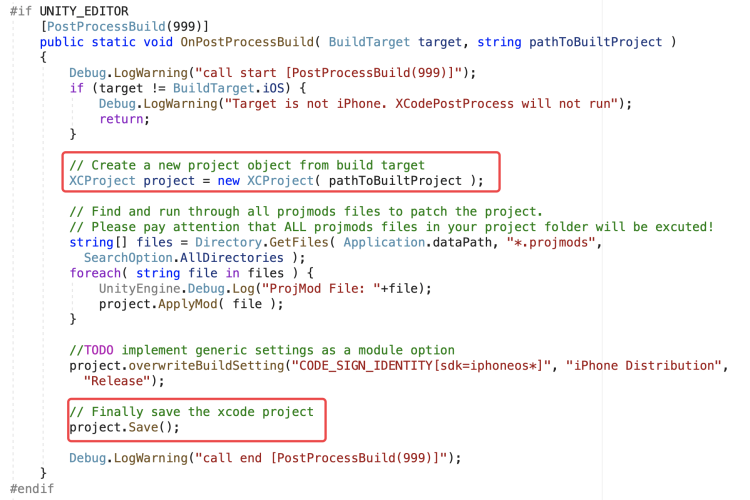
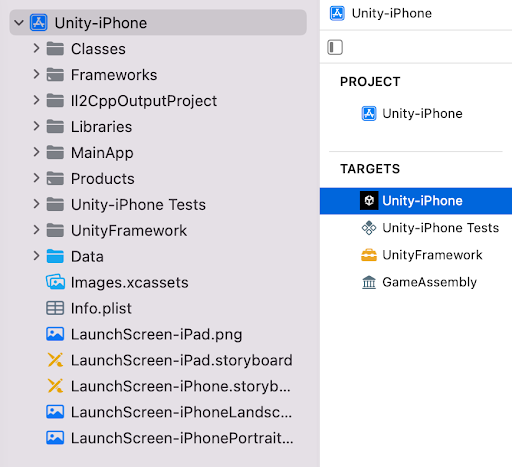
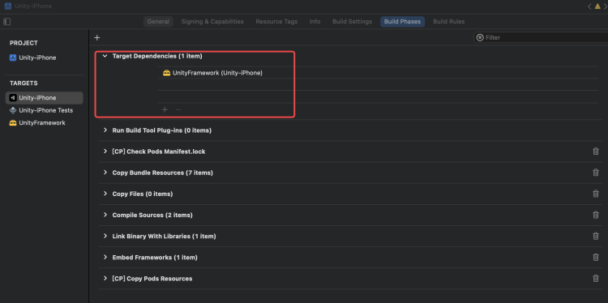
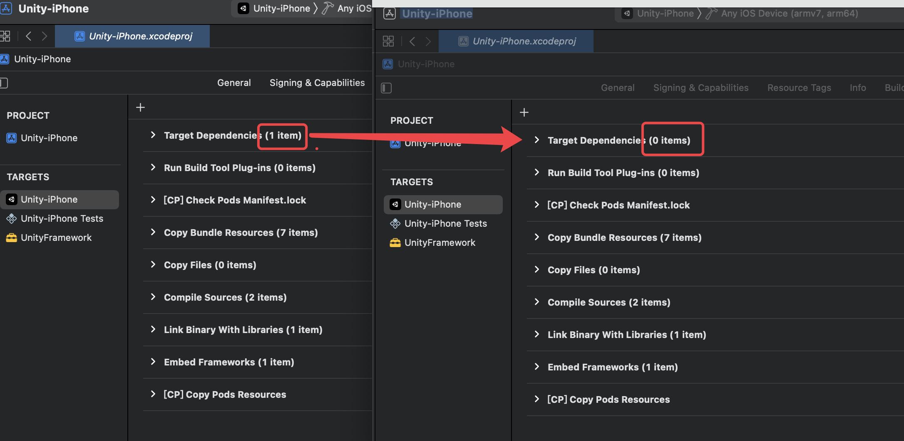

---

layout: post

title: XUPorter和Unity 2019.3及以上版本冲突问题详解

tags: [unity]

Author: Steve.liu

---

最近遇到了Unity上的一些问题，两年前处理过，后来忘记了，最近又重头分析处理了一边，随手记录一下吧

## 一、XUPorter简介

[github地址](https://github.com/onevcat/XUPorter)
[博客地址](https://onevcat.com/2012/12/xuporter/)

XUPorter是喵神Onevcat编写的Unity插件，主要用于读取Xcode工程文件并进行解析，之后在Unity工程的Assets目录下寻找所有的.projmods文件，并根据文件内容向工程中添加文件或库。

整体工作流程

- Unity导出Xcode工程
- Xcode工程调用Cocoapods开始下载配置第三方库
- XUPorter读取并缓存Xcode工程配置为XCProject对象  new XCProject
- XUPorter读取预设配置，并加入XCProject对象中 
- XUPorter将预设配置对象XCProject覆写到Xcode工程中  project.Save()

流程如下所示：

## 二、Unity 2019.3

在Unity 2019.3以后，unity对项目结构进行了修改

每个生成的 Unity iOS Xcode 项目都具有以下结构和目标：

- Unity-iPhone ： Unity-iPhone目标中的一个瘦启动器部分。它包括MainApp文件夹和应用程序表示数据，如启动屏幕、.xib文件、图标、数据和/Info.plist文件，并运行库。Unity -iPhone目标对UnityFramework目标只有一个依赖项。
- UnityFramework ： UnityFramework目标中的库部分。它包括Classes、UnityFramework和Libraries文件夹，以及依赖框架，Xcode 使用它来构建UnityFramework.framework文件。

其中 Unity-iPhone 对 UnityFramework 的依赖是通过 Unity-iPhone 的 Build Phases 中的 Target Dependencies 来实现的，如下所示：

## 三、冲突原因

XUPorter是一个比较老的库，在Unity3.5时期开发的，无法预见到Unity后期项目结构调整。

XUPorter在上述所说的这两步操作中

- new XCProject时，并未将项目Unity-iPhone的Target Dependencies读取
- project.Save()时;   将上一步没有读取到Target Dependencies的Unity-iPhone配置覆写到Unity-iPhone中

导致在XUPorter操作之后，将Target Dependencies置为空，也就导致了Unity-iPhone 对 UnityFramework 的依赖中断

